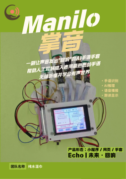

# Manilo掌音 — AI手语手套康复系统

<p align="center">
  
</p>

> **Echo | 未来·回响赛道**
> 
> 一副让声音发出"回响"的AI手语手套，帮助人工耳蜗植入者用最熟悉的手语，无缝听懂并学会有声世界。

---

## 一、项目基本信息

| 项目 | 内容 |
|------|------|
| **项目名称** | Manilo掌音 |
| **团队名称** | 纯水湿巾 |
| **参赛赛道** | Echo \| 未来·回响 |
| **项目简介** | 我们是一副让声音发出"回响"的AI手语手套，帮助人工耳蜗植入者用最熟悉的手语，无缝听懂并学会有声世界。产品形态为智能手套硬件 + 小程序 + 网页端管理看板。 |

---

## 二、项目演示

<p align="center">
  
</p>

**演示视频**: [B站链接 / 百度网盘链接] *(待补充)*

---

## 三、硬件架构

### 3.1 硬件组成

| 模块 | 说明 | 来源 |
|------|------|------|
| **运行板（主控）** | STM32F407 开发板，负责数据采集与通信 | 成品购买 |
| **屏幕盒子** | 2.8寸 TFT 液晶显示模块，用于状态展示与交互 | 成品购买 |
| **智能手套（核心器件）** | 集成弯曲传感器阵列、蓝牙串口通信的手语识别手套 | **48小时现场制作** |

> 硬件核心创新点：运行板与屏幕盒子为成品购买，**手套部分在48小时黑客松期间现场制作**，包括传感器布线、信号采集电路调试、手套本体与电子模块的集成。

### 3.2 硬件原理

- **传感器**: 手指弯曲传感器阵列（Flex Sensor）实时采集手指姿态
- **信号处理**: STM32F4 采集模拟信号，通过 ADC 转换后打包发送
- **通信**: 蓝牙串口（HC-08）将数据无线传输至 PC 端
- **反馈**: 屏幕实时显示识别状态与拼音/手势结果

---

## 四、软件架构

```
Manilo掌音
├── 硬件端 (STM32F4)
│   └── 传感器采集 + 蓝牙发送
├── PC 推理端
│   ├── pc_inference.py     (手势/拼音 AI 推理)
│   ├── asr_whisper.py        (语音跟读识别)
│   └── tts_win.py           (语音合成播报)
├── 后端服务
│   └── mqtt_bridge.py       (MQTT + Flask HTTP API)
├── 学生端 (A端)
│   └── templates/dashboard.html
└── 教师/家长端 (B端)
    ├── index.html            (Vue 3 + ECharts)
    ├── app.js
    └── styles.css
```

---

## 五、快速启动指南

### 5.1 硬件连接

1. **给运行板供电**: 连接 USB 数据线至 PC 或移动电源
2. **确认蓝牙连接**: HC-08 蓝牙模块与 PC 完成配对（默认 COM 端口）
3. **检查屏幕**: 屏幕亮起并显示主界面即为正常

### 5.2 启动后端服务

```bash
# 进入后端目录
cd backend/

# 确保 Python 环境已激活（如使用 Anaconda）
# 然后直接运行
python mqtt_bridge.py
```

后端默认启动在 `http://localhost:5000`

### 5.3 启动前端

**学生端（A端 — 主站）**：
浏览器直接访问：`http://localhost:5000`

**教师/家长端（B端 — 看板）**：
```bash
# 方式一：直接运行启动脚本
start_admin_dashboard.bat

# 方式二：手动启动
cd frontend/
python -m http.server 5174 --bind 127.0.0.1
# 然后访问 http://localhost:5174
```

### 5.4 启动 PC 推理

```bash
# 进入后端目录
cd backend/

# 启动推理进程（需指定串口）
python pc_inference.py --port COM7 --voice
```

### 5.5 一键启动（推荐）

```bash
# 在项目根目录下执行
start_all.bat
```

此脚本会自动检查并启动：
1. MQTT Broker（需先安装 Mosquitto）
2. Flask 后端服务
3. 前端管理看板
4. PC 推理进程

---

## 六、环境依赖

### Python 依赖

```
flask
paho-mqtt
numpy
onnxruntime
faster-whisper
```

### 前端依赖

前端使用 Vue 3 和 ECharts，依赖已本地化到 `frontend/vendor/`，无需网络即可运行。

### 系统环境变量（可选）

```powershell
$env:LLM_API_URL = "https://api.openai.com/v1/chat/completions"
$env:LLM_MODEL = "your-model-name"
$env:LLM_API_KEY = "your-api-key"
```

---

## 七、项目演示链接

- **演示视频**: [B站链接 / 百度网盘链接] *(待补充)*
- **线上体验**: 暂无公网部署
- **路演 PPT**: 见 `pitch/` 目录

---

## 八、仓库目录说明

| 目录 | 说明 |
|------|------|
| `backend/` | Flask 后端、MQTT Bridge、AI 推理、语音处理 |
| `frontend/` | B 端教师/家长看板（Vue 3 + ECharts） |
| `hardware/` | STM32F4 硬件工程代码 |
| `docs/` | 接口文档、配置说明 |
| `pitch/` | 路演 HTML 演示与报告材料 |
| `showcase.html` | 16:9 路演封面 |

---

## 九、联系方式

- **团队**: 纯水湿巾
- **赛事**: 学军70年 · Echo回响赛道
- **仓库**: https://github.com/norammm123/Manilo-

---

> "教育是一个每个人都被塑造过、每个人都可以重塑它的领域。" —— Echo回响赛道
>
> 我们希望，今天投下的这一颗石子，能在更多孩子心中激起回响。
